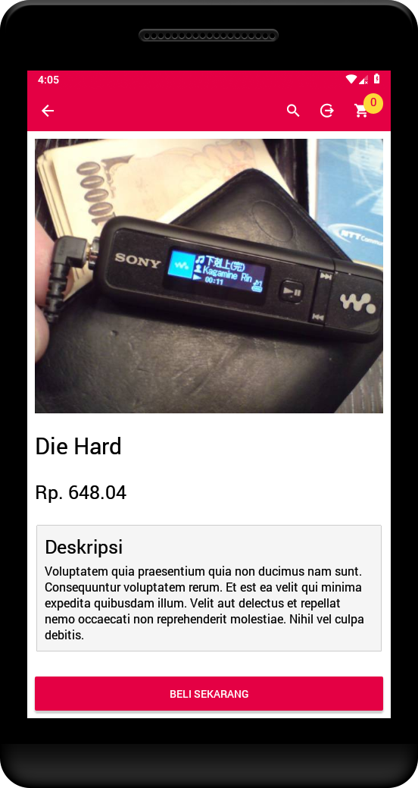

## Task 01 Arkademy

### Bukalapak Clone

Tugas minggu pertama bootcamp **Arkademy**. Membuat aplikasi E-Commerce dengan ketentuan **Product List, Product Detail, Cart, Payment Page**

### Tech :

- React Native
- Map
- State, Props
- React Router Navigation Flux
- Native Base

### Screenshot :

  
  
  
  

